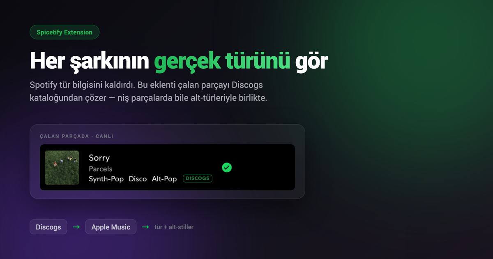

# What's That Genre? Plus

A [Spicetify](https://spicetify.app) extension that restores **genres and sub-styles for the current track** in Spotify's now-playing bar, using Discogs with a keyless Apple Music fallback.

<p align="center">
  <picture>
    
  </picture>
</p>

## How it works

1. **Discogs** is queried first for up to five ranked release styles and genres—no API key required.
2. **Apple Music / iTunes Search** is the keyless fallback, verified against title, artist, album, and duration.
3. Results are cached per track in `localStorage`; uncertain matches fail closed as **Genre not found**.

A `DISCOGS` or `TRACK` badge identifies the source. No API key, bundled database, or configuration is required.

## Install

**Marketplace:** Spotify → Marketplace → search **“What's That Genre? Plus”** → Install.

**Manual:** download [`dist/whatsThatGenre-plus.js`](./dist/whatsThatGenre-plus.js), copy it to `~/.config/spicetify/Extensions` (macOS/Linux) or `%userprofile%/.spicetify/Extensions/` (Windows), then run:

```bash
spicetify config extensions whatsThatGenre-plus.js
spicetify apply
```

## Credits

Forked from [LucasOe/spicetify-genres](https://github.com/LucasOe/spicetify-genres), whose original code is MIT-licensed and was inspired by Tetrax-10 and soapu. Genre/style data comes from [Discogs](https://www.discogs.com) with [Apple Music](https://music.apple.com) fallback. Built with [Spicetify Creator](https://github.com/spicetify/spicetify-creator).

## License

MIT — see [LICENSE](./LICENSE).
