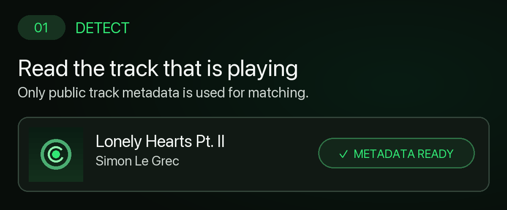
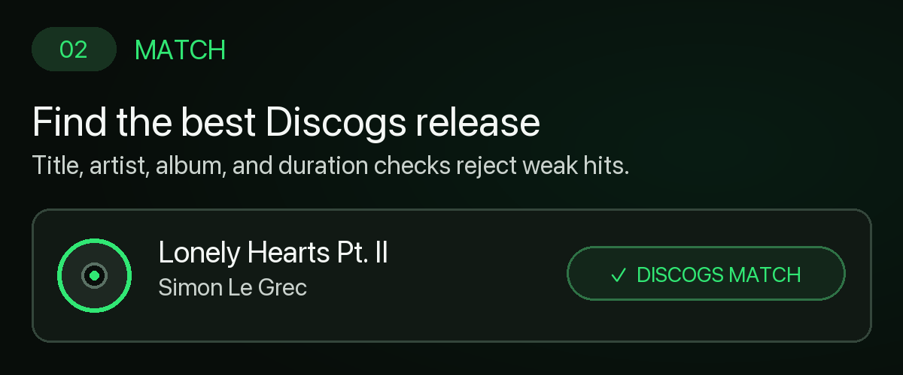
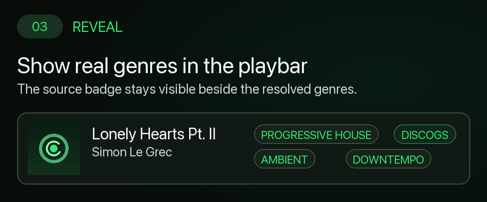

# What's That Genre? Plus

A [Spicetify](https://spicetify.app) extension that restores **genres and sub-styles for the current track** in Spotify's now-playing bar, using open music databases instead of Spotify's removed genre source.

> **Privacy-safe preview:** generic, fixed showcase data only—no personal Spotify account, library, playlist, or listening history.

<details>
<summary><strong>▶ See it work — 3 steps</strong></summary>

<br>

**1 · Detect — read the playing track**



**2 · Discogs match — verify the best release**



**3 · Playbar reveal — show the resolved genres**



<p align="center"><a href="https://abdullahpesteli.github.io/whatsThatGenre-plus/">Open full interactive demo</a> · <a href="./preview.mp4">Watch 18s preview</a></p>

</details>

## Install

**Marketplace:** Spotify → Marketplace → search **“What's That Genre? Plus”** → Install.

**Manual:** download [`dist/whatsThatGenre-plus.js`](./dist/whatsThatGenre-plus.js), copy it to `~/.config/spicetify/Extensions` (macOS/Linux) or `%userprofile%/.spicetify/Extensions/` (Windows), then run:

```bash
spicetify config extensions whatsThatGenre-plus.js
spicetify apply
```

## How it works

1. **Discogs** is queried first for up to five ranked release styles/genres.
2. **Apple Music / iTunes Search** is the keyless fallback, with title, artist, album, and duration checks.
3. Results are cached per track in `localStorage`; uncertain matches fail closed as **Genre not found**.

No API key, bundled database, or configuration is required. A `DISCOGS` or `TRACK` badge identifies the source.

<details>
<summary><strong>Build from source</strong></summary>

```bash
bun install
bun run build-local   # outputs dist/whatsThatGenre-plus.js
```

</details>

## Credits

Forked from [LucasOe/spicetify-genres](https://github.com/LucasOe/spicetify-genres), itself inspired by Tetrax-10 and soapu. Genre/style data comes from [Discogs](https://www.discogs.com) with [Apple Music](https://music.apple.com) fallback. Built with [Spicetify Creator](https://github.com/spicetify/spicetify-creator).

## License

MIT — see [LICENSE](./LICENSE).
